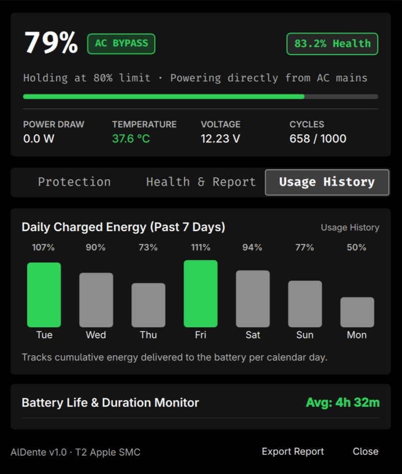

# AlDente for Omarchy

[](LICENSE)
[](https://archlinux.org/)
[](https://github.com/basecamp/omarchy)
[](https://python.org/)
[](https://systemd.io/)

A native **AlDente-style** battery health management, charge limiting, and diagnostics suite built for **Omarchy** and Arch Linux.

Designed specifically for Apple hardware running Linux (MacBook Pro with T2 / Apple SMC) and standard Linux laptops featuring ACPI charge threshold support (`charge_control_end_threshold`).

---

<p align="center">
  
</p>

---

## Key Features

### 1. Hardware Charge Limiter with Genuine AC Bypass
- Restricts battery charging to a user-defined threshold (default **80%**, configurable between 50% and 100%).
- Upon reaching the limit, the charging circuit is disengaged and the system operates strictly on **mains AC pass-through power**, eliminating battery micro-cycling.
- Writes directly to the Apple SMC charging register (`battery_charge_limit`) or generic Linux ACPI thresholds.

### 2. Hardened Root Broker & Boot Persistence
- Hardware charge limits are brokered through a root-owned, strictly validated helper (`/usr/local/libexec/aldente-set-limit`), keeping the kernel sysfs node securely root-owned with verified non-world-writable permissions.
- Incorporates `udev` device event forwarding and a systemd service (`aldente-hardware.service`) to automatically restore the user's saved threshold on boot and wake.
- **Run setup once with sudo**: installs the root helper and system services; normal daily limit changes require no password prompts.

### 3. Sailing Mode (Hysteresis Buffer)
- Permits battery level fluctuation within a configurable buffer (e.g. 75%–80%) while remaining connected to AC power.
- Prevents constant recharge engagement when the battery drops by a fraction of a percent, drastically reducing electrochemical degradation.

### 4. Heat Protection (Thermal Guard)
- Continuously monitors battery cell temperatures in real-time.
- Automatically pauses charging if cell temperature exceeds 40.0°C and resumes once temperatures stabilize under 37.5°C.

### 5. 100% Top-Up Mode
- Single-click temporary bypass to charge the battery to 100% prior to travel or for battery gauge calibration.
- Automatically reverts back to your configured hardware limit once 100% is reached.

### 6. macOS-Grade Health Diagnostics & Reporting
- Real-time telemetry: instantaneous power draw (W), voltage (V), temperature (°C), and discharge rate.
- Health analytics: wear level (%), maximum capacity loss in Watt-hours, and cycle counts against rated lifespan.
- One-click export of structured diagnostic reports in Markdown format to `~/battery_report.md`.

### 7. Daily Charging Graph & Session Duration Tracker
- Interactive 7-day bar chart displaying daily cumulative energy delivered to the cell (in % and Watt-hours).
- Discharge duration monitor that logs every unplugged session, recording exact battery life, drain rate (%/hour), and average power draw.

---

## Feature Comparison

| Capability | AlDente (macOS Pro) | AlDente for Omarchy | Standard Linux Battery Applets |
| :--- | :---: | :---: | :---: |
| Hardware Charge Limiting | Yes | **Yes** | Rare / Manual script |
| Genuine AC Bypass Mode | Yes | **Yes** | No |
| Sailing Mode (Hysteresis) | Yes | **Yes** | No |
| Thermal Guard Protection | Yes | **Yes** | No |
| 100% Travel Top-Up Auto-Revert | Yes | **Yes** | No |
| Daily Charging Energy Chart | Yes | **Yes** | No |
| Discharge Session Duration Logs | Partial | **Yes** | No |
| Automated Reboot Persistence | Yes | **Yes (5-Layer)** | No |
| Native Omarchy Status Bar Widget | N/A | **Yes** | No |
| Fully Open Source & Free | No (Commercial) | **Yes (MIT)** | Yes |

---

## Quick Start

### Installation

1. Clone the repository into your Omarchy plugin directory:
   ```bash
   git clone https://github.com/monkonthehill/omarchy-aldente.git ~/.config/omarchy/plugins/aldente
   ```

2. Run the user setup installer:
   ```bash
   cd ~/.config/omarchy/plugins/aldente
   ./install.sh
   ```

3. Configure permanent hardware write permissions (run once with `sudo`):
   ```bash
   sudo ./setup-hardware.sh
   ```

### Removal / Uninstallation

To safely remove the plugin, service, and CLI shortcuts:
```bash
cd ~/.config/omarchy/plugins/aldente
./uninstall.sh
# Optional: To also remove system boot services and reset hardware limit to 100%:
sudo ./uninstall.sh
```

---

## Usage

### Omarchy Status Bar
- **Top Bar Widget**: Shows current battery percentage with a compact, minimal footprint.
- **Left-Click**: Toggles the interactive dashboard (Protection, Health Diagnostics, Usage Graphs).
- **Right-Click**: Instantly toggles 100% Top-Up Mode.

### Command-Line Interface (`aldente`)

```bash
# View live telemetry, health, and configuration
aldente status

# Output raw JSON for scripts or custom bars
aldente status --json

# Set hardware charge limit to 80%
aldente set-limit 80

# Enable Sailing Mode with a 5% delta buffer
aldente sailing on --delta 5

# Enable Heat Protection with a 40°C threshold
aldente heat-guard on --threshold 40.0

# Activate temporary 100% Top-Up for travel
aldente top-up on

# Generate full diagnostic report
aldente report
```

---

## Documentation

Detailed technical documentation is available in the [`docs/`](docs/) directory:

- [Architecture & Design](docs/ARCHITECTURE.md): Sysfs register abstraction, Quickshell IPC, daemon lifecycle, and thermal algorithms.
- [Hardware Persistence](docs/HARDWARE_PERSISTENCE.md): Technical breakdown of the 5-layer boot persistence architecture.
- [CLI Reference](docs/CLI_REFERENCE.md): Comprehensive documentation of all commands, options, and JSON outputs.
- [Troubleshooting & Diagnostics](docs/TROUBLESHOOTING.md): Solutions for permission errors, register verification, and state resets.

---

## Hardware Compatibility

- **Apple MacBook Pro (T2 Security Chip)**: Full hardware charge control via Apple SMC sysfs register (`/sys/devices/.../APP0001:00/battery_charge_limit`).
- **Standard Linux Laptops**: Compatible with devices exposing `/sys/class/power_supply/BAT*/charge_control_end_threshold` (e.g., Lenovo ThinkPad, ASUS ROG/ZenBook, Dell XPS, Framework).

---

## License

This project is licensed under the MIT License. See [LICENSE](LICENSE) for details.
